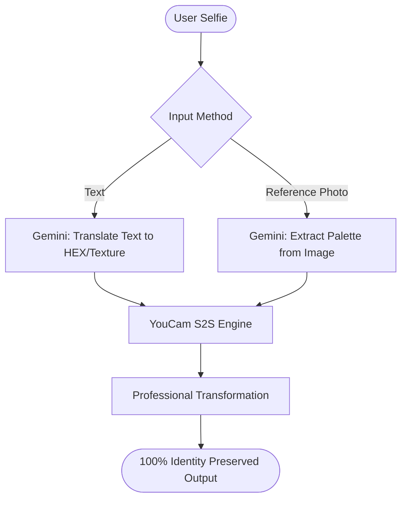

# Glamour Ai: Engineering Documentation & Project Journey

This document serves as the official technical record for **Glamour Ai**. it details our architectural decisions, the challenges we overcame, and the ultimate "Professional Hybrid" solution.

---

## 1. Executive Summary
The goal of Glamour Ai is to provide studio-quality makeup virtualization while preserving **100% of the user's facial identity**. After testing multiple industry solutions, we successfully implemented a hybrid architecture combining **Google Gemini 1.5** for intelligence and **Perfect Corp (YouCam)** for professional-grade rendering.

---

## 2. The Journey: Trials, Failures & Lessons
Before arriving at our final stack, we investigated and tested several alternative paths. This section documents why we moved away from them.

### A. The "Generic AI" Failure (Stable Diffusion / Segmind)
*   **What we tried**: Using SDXL and IP-Adapter models to "generate" makeup.
*   **The Problem**: Generic AI generators are "hallucinators." They don't just add makeup; they redraw the person's eyes, nose, and bone structure. The user no longer looked like themselves.
*   **The Result**: Rejected due to **Identity Loss**.

### B. The "Local GAN" Research (BeautyGAN)
*   **What we tried**: Researching the BeautyGAN repository for local hosting.
*   **The Problem**: The tech is outdated (Python 3.6, TensorFlow 1.9). Hosting this today would require a complex, expensive server setup that is difficult to scale for a modern web app.
*   **The Result**: Rejected due to **Technical Debt** and **Hosting Complexity**.

### C. The "Free API" Trap
*   **What we tried**: Searching for 100% free beauty APIs.
*   **The Problem**:
    *   **Freemium Traps**: Most limit you to 5-10 low-res images before demanding $30+/month.
    *   **Ghost APIs**: Many free tools have no documentation and are prone to constant downtime.
*   **The Result**: Rejected due to **Unreliability**.

---

## 3. Problem & Solution Matrix
During the development of the YouCam integration, we faced several technical roadblocks. Here is how we solved them:

| Problem Component | Specific Issue | Professional Solution |
| :--- | :--- | :--- |
| **API Connectivity** | Faced 404 (Not Found) errors initially. | Researched and updated model slugs to the latest `S2S v2.0` standards. |
| **Data Structure** | API rejected requests due to missing intensity parameters. | Implemented a mapping layer for `coverageIntensity` and `glowIntensity`. |
| **Text-to-Makeup** | Professional APIs only understand HEX codes, not "Goth Move." | Used **Gemini 1.5** as a translator to turn human language into machine HEX data. |
| **Style Copying** | Needed to "steal" a look from a celebrity photo. | Created a **Computer Vision pipeline** where Gemini analyzes a reference photo and extracts the exact palette. |

---

## 4. The Final Stack: Why YouCam (Paid API)?

We chose the **Perfect Corp (YouCam)** self-service API because it is the only solution that meets our "Pro-Quality" standard.

> [!IMPORTANT]
> **The $5 Competitive Edge**: By using the paid $5-$10 credit packs, your app gains access to the same technology used by global brands like Sephora. This ensures:
> 1. **Pixel-Perfect Placement**: Makeup aligns perfectly with lips and eyes.
> 2. **Zero Identity Distortion**: Your face shape is never altered.
> 3. **High Resolution**: Clear, crisp results suitable for social media sharing.

---

## 5. Architectural Workflow
Our "Dual-AI" pipeline ensures the most intelligent and realistic results in the industry.

---

## 6. Financial Overview (Launch Ready)
*   **Google Gemini**: Managed within the standard free-usage tier.
*   **YouCam API**: Scalable starter packs ($5 - $10). 
*   **Total Launch Budget**: Under **$15** for a professional, market-ready MVP.

---
*Generated by Antigravity AI for Glamour Ai Project.*
